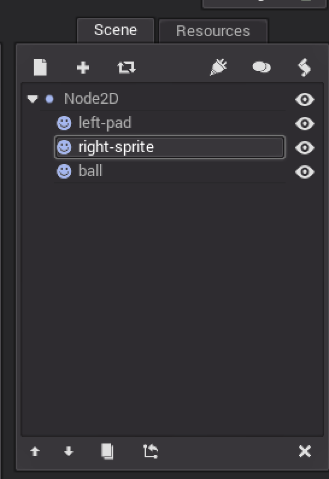

# Nodes

The assets of a Godot project are organized as a tree of Nodes, where every Node can have a parent and a varying number of children. A Node is a type of object that has:
- A name
- Editable properties
- A callback function to execute every frame

A Node is basically a datatype that has paramers and behavior. Most of the other extend from Node, and we can also make our own.

## Scenes

A Scene is a composition of Nodes. It has these features:
- Has exactly one root Node
- Can be saved to disk and loaded back
- Can be instanced
- Running a Scene means running the game
- There can be several Scenes in a project
- One of them must load first in order to run the game

Godot is a *Scene Editor*; all of it revolves around the concept of editing Scenes and the Nodes that compose it.

## Exercise 1

- Create a new project and generate a Node tree that looks like this:

- Run the Scene
- Save the Scene and try to run it again
- Configure the project to run the current Scene
