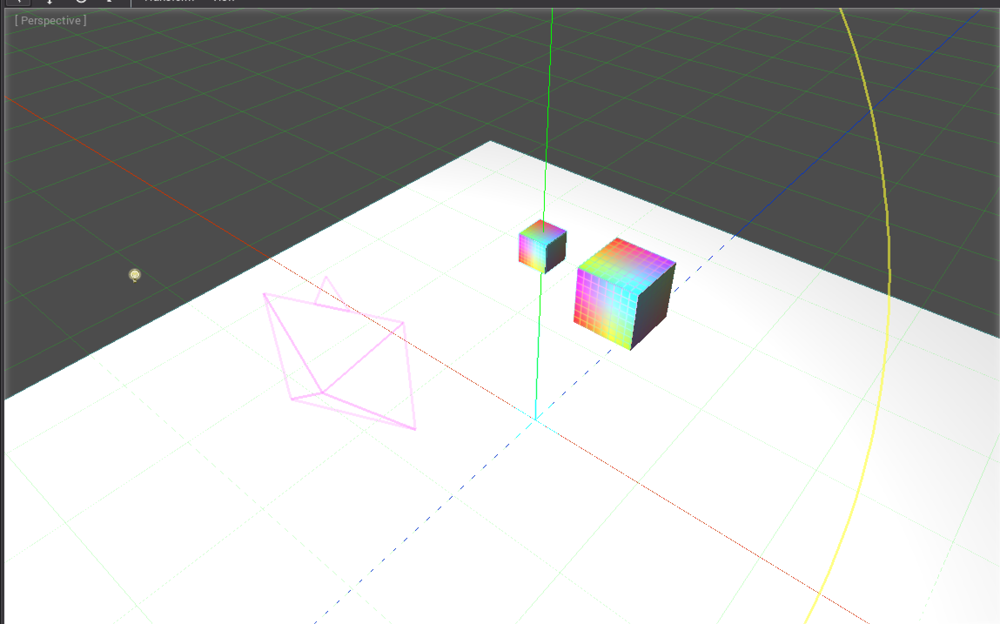

# Creating a 3D Scene 

Along these lessons, I'm sure you've seen that there are way too many types of Nodes. We've seen the basics of how to work with Godot, now we can put it to practice with some help of the documentation tab.

In the documentation tab, you can look for reference of Classes, methods, constants and so on, getting familiar with it is very important for accomplishing more complex projects.

## Excercise 12

- Make The following node tree:


- Arrange the Nodes according to the following:
	- The CollisionShape on the RigidBody should match the TestCube's position and size.
	- The Camera should look at the TestCube on the RigidBody.
	- The StaticBody is the floor and should be flat under everything else and big enough to move around it.
	- StaticBody 2 should be nearly twice the size of the RigidBody's TestCube.

- Add the key actions to the RigidBody to move around, we will reuse the actions set on our pong example.
```
func _input(ev):
	if(ev.type == InputEvent.KEY):
		if(ev.is_action('right_up')):
			walk(Vector3(0, 0, -1))
		elif(ev.is_action('right_down')):
			walk(Vector3(0, 0, 1))
```
- Remember that you should extend from a class and activate input processing ;)
- The cool thing about RigidBody Nodes is that they provide very useful methods for applying forces to our object with ease (pun intended):
```
func walk(dir):
	velocity = get_linear_velocity()
	apply_impulse(origin, dir) #note the origin variable, you have to set it as a member
```
- Wouldn't it be more interesting if we could jump? (add the key binding) 
```
func jump():
	apply_impulse(origin, up*3)
```
- If you run the project now, it may have some quirky behaviour, we have to use the state of our object to fix those, for example, you could limit the maximum walk speed with an evaluation:
```
if velocity.length() > MAX_WALK_SPEED:
	set_linear_velocity(velocity.normalized()*MAX_WALK_SPEED)
```

It's common to have some platforming, collision detection and ray casting are the methods we can use to add more interaction to the scene. We will make the cube hang to the ledge of the bigger cube and then climb it.

- Add a nested static body to the bigger cube and then a CollisionShape that represents a ledge, make sure the cube can actually enter the body.
- Set the trigger property to on. This means we will implement our own behavior for that collision instead of stoppping our character.
```
func _body_enter_shape(bodyID, body, shape, localShape):
	elif body.has_method('collide'):
		body.collide(self, space)
```
- This function is a signal of the StaticBody, a signal we must enable, add the following to the _ready function:
```
set_contact_monitor(true)
connect('body_enter_shape', self, "_body_enter_shape")
```
- Add a script to the ledge's StaticBody, what we're going to do is fire a function when the player enters the ledge area, then cast a ray to get the height of the ledge and lock the cube in there.
```
func collide(_collider, space):
	collider = _collider # attention here
	if collider.jumping: # uh oh! 
		var rayXZ = collider.get_translation() + collider.facing/5 # facing? where did this come from?
		var ledgeFloor = space.intersect_ray(rayXZ + marginUp, rayXZ - marginUp * 3, [collider]) #hint: what's marginUp? 
	if !ledgeFloor.empty():
		collider.set_axis_lock(2)
```
- We would like to listen for keys to unhook the cube and make it either fall or climb, for climbing, we're going to apply a force that pushes up our cute little cube:
```
func _input(ev):
	if (ev.is_action('right_up') or ev.is_action('right_down')) and ev.is_pressed():
		set_process_input(false) # hint hint
		collider.set_axis_lock(0) # collider_
	if ev.is_action('right_up') and ev.is_pressed():
		collider.apply_impulse(collider.get_translation() + Vector3(0, -0.3, 0.1), collider.get_translation() + Vector3(0, 5, -0.5))
```
- If you filled the blanks on the code, the cube should be able to climb now. There's still a problem we haven't fixed, in the process, you should've added a "jumping" flag to the cube, but we have to turn that flag off in order to be able to jump more than once. For that, we will listen for a collision with the floor:
```
if bodyID == floorID: #floorID = get_node('/root/Spatial/StaticBody').get_instance_ID():
	jumping = false
```

